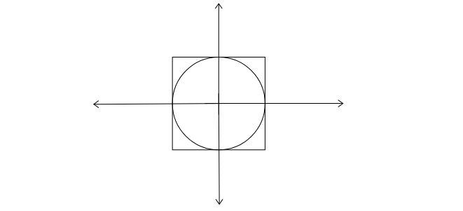

# Randomized Algorithms

## Approximating pi
The randomness in this algorithm comes from the random choosing of points in a 2x2 space where the corners of the square are at the points (-1,-1), (-1,1), (1,-1), and (1,1).  

This makes the area of the square equal to 4r^2 and the area of the circle equal to pi r^2.  By dividing these two ratios, we can cancel out the radii and are left with a constant times pi.  

We are left with the equation number_of_points_in_circle/number_of_points_in_rectangle = pi/4

## Quicksort
